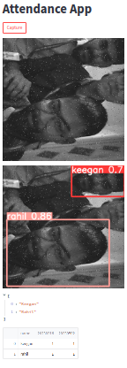

Welcome to the Attendance Detection Project!

This project is designed to help you automate the attendance process in your classroom or workplace using Flask and YOLO (You Only Look Once) object detection algorithm. With the Attendance Detection Project, you can quickly and accurately detect attendance using computer vision technology.

To get started, simply upload a photo or video of your class or workplace to the Flask server. The server will use the YOLO algorithm to detect the faces of the individuals in the photo or video and compare them to a pre-existing database of known individuals. If a match is found, the server will mark that individual as present for the day.

The Attendance Detection Project is highly accurate, making it an ideal solution for any organization that needs to keep track of attendance. Whether you are a teacher looking to streamline your classroom attendance process or an HR manager looking for a more efficient way to track employee attendance, the Attendance Detection Project has you covered.

We hope you enjoy using the Attendance Detection Project and that it helps make your attendance process more efficient and accurate. If you have any questions or feedback, please feel free to contact us. Thank you for choosing the Attendance Detection Project!

